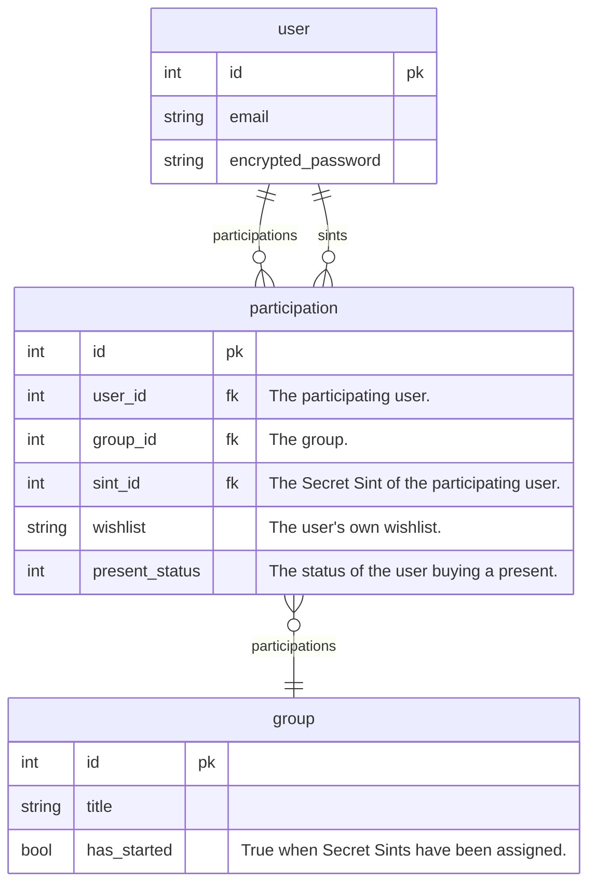

# Secret Sint

The Dutch version of Secret Santa, allowing users to form groups and track the delivery of their presents.

A fully fledged React app backed by a Ruby on Rails API.
Across the whole stack, the code is well-formatted, well-structured and well-tested, as can been seen in the [code examples](#code-examples-groups).

The architecture of the project demonstrates 
[separation of concerns](https://en.wikipedia.org/wiki/Separation_of_concerns) and
[loose coupling](https://en.wikipedia.org/wiki/Loose_coupling), 
and follows Rails and React best-practises. The code is clear and self-documenting, requiring few comments.

## Table of Contents

- [Technologies used](#technologies-used)
- [Screenshots](#screenshots)
- [Domain model](#domain-model)
- [Data model](#data-model)
- [Code examples: groups](#code-examples-groups)

## Technologies used

**Server-side**: `Ruby` `Rails` `Devise` `Devise JWT`

**Client-side**: `TypeScript` `React` `JSX` `TailwindCSS` `React Router` `Zod` `Vite` `Vitest` `React testing library`

## Screenshots

## Domain model

This domain model specifies the Domain Specific Language used in the app, and how they relate to eachother.

- Users
  - Users can sign up and log in to the app.
- Groups
  - Groups can be created by users.
  - Multiple users can belong to a group
  - A user can be part of many groups.
  - A group needs at least 3 users to start playing Secret Sint.
- Invitations
  - Any user that's part of a group can invite other users to it.
  - Once a group has started, no more users can be invited to it.
- Wishlists
  - Before a group starts playing, each user can fill in their wishlist.
  - Users can't see each other's wishlists.
- Secret Sint
  - When a group starts playing Secret Sint, every user of the group is assigned a Secret Sint, which is another user.
  - A Secret Sint can see who they are assigned to, but an assignee can't see who their Secret Sint it.
  - A Secret Sint can see their assignee's wishlist.
- Present status
  - Each Secret Sint can update the status of their present: Not started, ordered, delivered.
  - Users can't directly see the present status of other Secret Sints. 
- Group progress
  - Each group shows metrics about the group's progress. All group members see the same metrics.
  - When a group has less than 3 members, it shows the progress towards getting 3 members.
  - Before a group has started, it shows how many people have supplied their wishlist.
  - After a group has started, it shows how many Sints have ordered their presents.
  - After at least one Sint has ordered their present, it shows how many presents have been delivered.

## Data model

The data model consists of *users*, *groups* and a pivot table between them called *participations*.

A single participation references two users: the user participating and the user which is assigned the Sint of the participating user.

## Code examples: *groups*

These are the source files involved with *groups* (DSL),
showing the processes and technologies used across the whole stack.

At every significant step, the behavior is tested at the appropriate level using specs. The specs are linked next to the source files.

Parallel series of source files exist for dealing with *users*, *invitations*, *wishlists* and *present statuses*.

- Server-side `Ruby` `Rails`
  - Database migration `ActiveRecord` - [20230331183825_create_groups.rb](api/db/migrate/20230331183825_create_groups.rb)
  - Object relational model `ActiveRecord` - [group.rb](api/app/models/group.rb)
  - TODO: specs, factories, seeds...
  - Controller `ActiveController` - [groups_controller.rb](api/app/controllers/groups_controller.rb)
  - Base controller `ActiveController` - [application_controller.rb](api/app/controllers/application_controller.rb) -
    *Catches some exceptions to return meaningful responses.*
- Client-side `TypeScript` `Vite`
  - REST API client - 
    *Provides a simple interface to make API requests, provided to React components through a React Context.*
    - API fetcher `Fetch` - [api-fetcher.ts](app/src/api/api-fetcher.ts)
    - API object - [create-api.ts](app/src/api/create-api.ts)
    - API context provider `React Context` - [api-context.tsx](app/src/contexts/api-context.tsx)
  - Validation schemata `Zod` -
    *Provides validation and processing of data coming from the API as well as data submitted into forms.*
    - Response schema -  [group.ts](app/src/schemata/group.ts), [group.spec.ts](app/src/schemata/group.spec.ts)
    - Request schema - [group-request.ts](app/src/schemata/group-request.ts), [group-request.spec.ts](app/src/schemata/group-request.spec.ts)
  - Hooks `React Hooks` - *These custom hooks abstract out state management patterns for various React components.*
    - Async hook - [use-async.ts](app/src/hooks/use-async.ts) - *Deals with loading and error states for async calls.*
    - Form hook `Zod` - [use-form.ts](app/src/hooks/use-form.ts) - *Validates form submissions against a Zod schema.*
    - Route parameter hook `React Router` - [use-group-id.ts](app/src/hooks/use-group-id.ts)
  - UI components `React` `JSX` `TailwindCSS` `React testing library` -
    *"Dumb" components that just render data and listen to DOM events.*
    - Generic form component - [Form.tsx](app/src/components/Form.tsx), [Form.spec.tsx](app/src/components/Form.tsx) - *Wraps common elements around forms.* 
    - Form component - [GroupForm.tsx](app/src/components/GroupForm.tsx), [GroupForm.spec.tsx](app/src/components/GroupForm.spec.tsx)
    - Progress component - [GroupProgress.tsx](app/src/components/GroupProgress.tsx),
      [GroupProgress.spec.tsx](app/src/components/GroupProgress.spec.tsx) - *Renders metrics about the group's progress.*
    - Elemental components - [Button.tsx](app/src/components/Button.tsx),
      [Input.tsx](app/src/components/Input.tsx),
      [ErrorText.tsx](app/src/components/ErrorText.tsx)
      [ProgressBar.tsx](app/src/components/ProgressBar.tsx),
      [Button.spec.tsx](app/src/components/Button.spec.tsx),
      [Input.spec.tsx](app/src/components/Input.spec.tsx),
      [ErrorText.spec.tsx](app/src/components/ErrorText.spec.tsx),
      [ProgressBar.spec.tsx](app/src/components/ProgressBar.spec.tsx)
  - Pages `React` `JSX` `TailwindCSS` -
    *Pages fire API requests based on user events and the current route. They hold the state resulting from those API responses and pass it onto UI components.*
    - Details page - [GroupDetail.tsx](app/src/pages/GroupDetail.tsx)
    - Create page - [NewGroup.tsx](app/src/pages/NewGroup.tsx)
    - Index page - [Groups.tsx](app/src/pages/Groups.tsx)
  - App element with routing `React` `JSX` `React Router` - [App.tsx](app/src/App.tsx)
  - Front-end entry file `React` `Vite ENV` -  [main.tsx](app/src/main.tsx)
  - Environment variables - [.env](app/.env)
